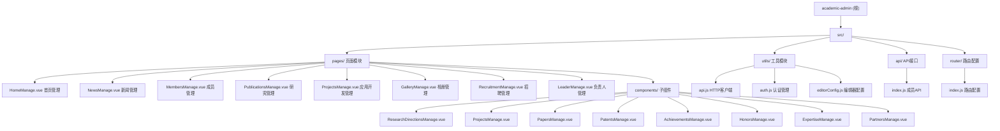

# Academic Admin - 学术主页管理系统

> **最后更新时间**：2025-01-08 17:12:45
> **文档版本**：1.0.0
> **项目状态**：✅ 已完成全面扫描

---

## 变更记录 (Changelog)

| 日期 | 版本 | 变更内容 | 作者 |
|------|------|----------|------|
| 2025-01-08 | 1.0.0 | 初始化项目文档，完成全仓扫描与分析 | Claude AI |

---

## 项目愿景

**Academic Admin** 是一个为学术研究团队设计的**后台管理系统前端**，用于管理和维护学术主页的各项内容。该系统提供了一个直观、易用的 Web 界面，使管理员能够轻松管理：

- 团队首页展示内容（幻灯片、负责人信息）
- 新闻动态发布与管理
- 团队成员信息与角色管理
- 研究成果（论文、项目、专利等）
- 相册与图片管理
- 招聘信息发布

**核心价值**：简化学术团队的内容管理工作，提高信息更新效率，确保对外展示内容的及时性和准确性。

---

## 架构总览

### 技术栈

```yaml
前端框架: Vue 3.4.0 (Composition API + script setup)
UI 组件库: Element Plus 2.5.0
富文本编辑器: WangEditor 5.1.23
状态管理: Pinia 2.1.7
路由管理: Vue Router 4.2.5
HTTP 客户端: Axios 1.6.2
构建工具: Vite 5.0.0
开发语言: JavaScript (ES6+)
样式预处理: Sass 1.69.5
日期处理: Day.js 1.11.10
```

### 系统架构

```
┌─────────────────────────────────────────────────────────────┐
│                      用户浏览器                              │
└─────────────────────────────────────────────────────────────┘
                              │
                              ▼
┌─────────────────────────────────────────────────────────────┐
│                   Vue.js 前端应用                            │
│  ┌──────────────┐  ┌──────────────┐  ┌──────────────┐      │
│  │  登录模块     │  │  管理后台     │  │  API 层       │      │
│  │ AppLogin.vue │  │ AppAdmin.vue │  │  utils/api   │      │
│  └──────────────┘  └──────────────┘  └──────────────┘      │
│         │                   │                   │            │
│         └───────────────────┼───────────────────┘            │
│                             │                                │
│  ┌──────────────────────────────────────────────────┐       │
│  │              Vue Router 路由层                    │       │
│  │  /home, /news, /members, /publications, etc.     │       │
│  └──────────────────────────────────────────────────┘       │
└─────────────────────────────────────────────────────────────┘
                              │
                              ▼
┌─────────────────────────────────────────────────────────────┐
│                   后端 REST API                              │
│              (academic-server 服务)                         │
│        http://localhost:8896/api (开发环境)                 │
└─────────────────────────────────────────────────────────────┘
```

---

## 模块结构图



---

## 模块索引

| 模块路径 | 职责描述 | 技术栈 | 状态 |
|---------|---------|--------|------|
| `src/pages/HomeManage.vue` | 首页内容管理（幻灯片、负责人信息、教育/工作经历） | Vue 3 + WangEditor | ✅ 已扫描 |
| `src/pages/NewsManage.vue` | 新闻动态管理（发布、编辑、删除、分类） | Vue 3 + WangEditor | ✅ 已扫描 |
| `src/pages/MembersManage.vue` | 团队成员与角色管理 | Vue 3 + Element Plus | ✅ 已扫描 |
| `src/pages/PublicationsManage.vue` | 研究成果管理（论文、项目、专利等） | Vue 3 + WangEditor | ✅ 已扫描 |
| `src/pages/ProjectsManage.vue` | 应用开发项目管理 | Vue 3 | ✅ 已扫描 |
| `src/pages/GalleryManage.vue` | 相册分类与图片管理 | Vue 3 | ✅ 已扫描 |
| `src/pages/RecruitmentManage.vue` | 招聘信息管理 | Vue 3 | ✅ 已扫描 |
| `src/pages/LeaderManage.vue` | 负责人信息管理 | Vue 3 + WangEditor | ✅ 已扫描 |
| `src/utils/api.js` | Axios 实例配置、请求/响应拦截器 | Axios | ✅ 已扫描 |
| `src/utils/auth.js` | Token 存储与管理 | localStorage | ✅ 已扫描 |
| `src/utils/editorConfig.js` | WangEditor 配置与图片管理 | WangEditor | ✅ 已扫描 |
| `src/router/index.js` | 路由配置与权限守卫 | Vue Router | ✅ 已扫描 |
| `src/api/index.js` | 成员与角色 API 封装 | Axios | ✅ 已扫描 |

---

## 运行与开发

### 环境要求

- **Node.js**: >= 16.0.0
- **npm**: >= 8.0.0

### 快速开始

```bash
# 1. 安装依赖
npm install

# 2. 配置环境变量
# 编辑 .env 文件，设置后端 API 地址
VITE_API_BASE_URL=http://localhost:8896/api

# 3. 启动开发服务器
npm run dev

# 4. 构建生产版本
npm run build

# 5. 预览生产构建
npm run preview
```

### 环境变量配置

项目使用 `.env` 文件配置环境变量：

```env
# 开发环境
VITE_API_BASE_URL=http://localhost:8896/api

# 生产环境示例
# VITE_API_BASE_URL=http://39.100.78.167:8801/api
```

**重要配置说明**：
- `VITE_API_BASE_URL`: 后端 API 基础地址（必须包含 `/api` 后缀）
- 开发服务器运行在 `http://localhost:8083`
- 开发环境下使用 Vite 代理转发 API 请求

### 访问地址

- **登录页面**: `http://localhost:8083/index.html`
- **管理后台**: `http://localhost:8083/admin.html`

---

## 测试策略

**当前状态**: ⚠️ 项目暂无自动化测试

**建议测试方案**：

### 单元测试
```javascript
// 推荐使用 Vitest + Vue Test Utils
npm install -D vitest @vue/test-utils
```

### E2E 测试
```javascript
// 推荐使用 Cypress 或 Playwright
npm install -D cypress
```

### 手动测试检查清单

- [ ] 登录功能（用户名/密码验证）
- [ ] Token 认证与自动跳转
- [ ] CRUD 操作（创建、读取、更新、删除）
- [ ] 图片上传与预览
- [ ] 富文本编辑器功能
- [ ] 分页与筛选
- [ ] 表单验证
- [ ] 错误处理与提示

---

## 编码规范

### Vue 组件规范

```javascript
// ✅ 推荐：使用 <script setup> 语法
<script setup>
import { ref, reactive, onMounted } from 'vue'

const loading = ref(false)
const form = reactive({})

onMounted(() => {
  // 初始化逻辑
})
</script>

// ❌ 避免：使用 Options API（除非必要）
<script>
export default {
  data() {
    return {}
  }
}
</script>
```

### 命名规范

- **组件文件**: PascalCase（如 `HomeManage.vue`）
- **工具文件**: camelCase（如 `api.js`, `auth.js`）
- **变量/函数**: camelCase（如 `loadData`, `handleSubmit`）
- **常量**: UPPER_SNAKE_CASE（如 `API_BASE_URL`）
- **CSS 类名**: kebab-case（如 `.card-header`, `.table-header`）

### 样式规范

```vue
<style scoped>
/* ✅ 推荐：使用 scoped 避免样式污染 */
.my-component {
  padding: 20px;
}

/* ✅ 推荐：深度选择器使用 :deep() */
:deep(.el-dialog__body) {
  padding: 20px;
}
</style>
```

### API 调用规范

```javascript
// ✅ 推荐：使用统一的 request 实例
import request from '../utils/api'

const loadData = async () => {
  try {
    loading.value = true
    const res = await request.get('/api/endpoint')
    // 处理响应
  } catch (error) {
    console.error('加载失败:', error)
  } finally {
    loading.value = false
  }
}
```

---

## AI 使用指引

### 项目上下文

这是一个**学术团队管理系统前端**，用于管理团队对外展示的各种内容。

### 关键业务逻辑

1. **认证流程**
   - 使用 JWT Token 进行身份验证
   - Token 存储在 localStorage
   - 自动检测登录状态并跳转

2. **图片管理**
   - 支持图片上传（头像、幻灯片、相册图片）
   - 自动删除编辑器中移除的图片
   - 使用 FormData 上传文件

3. **富文本编辑**
   - 使用 WangEditor 作为富文本编辑器
   - 支持图片插入与上传
   - 自动清理未使用的图片文件

4. **成员管理**
   - 支持角色管理（指导教师、专任教师、研究生、校友等）
   - 支持角色排序与显示控制
   - 成员可以关联角色

### 常见任务示例

#### 添加新的管理页面

```bash
# 1. 创建页面组件
touch src/pages/NewPageManage.vue

# 2. 在路由中注册
# 编辑 src/router/index.js
{
  path: '/newpage',
  name: 'NewPageManage',
  component: () => import('../pages/NewPageManage.vue'),
  meta: { title: '新页面管理', requiresAuth: true }
}

# 3. 在侧边栏添加菜单项
# 编辑 src/AppAdmin.vue
<el-menu-item index="/newpage">
  <el-icon><Icon /></el-icon>
  <span>新页面</span>
</el-menu-item>
```

#### 添加新的 API 接口

```javascript
// 编辑 src/api/index.js
export const newApi = {
  getList: () => request.get('/new-api/list'),
  getById: (id) => request.get(`/new-api/${id}`),
  create: (data) => request.post('/new-api', data),
  update: (id, data) => request.put(`/new-api/${id}`, data),
  delete: (id) => request.delete(`/new-api/${id}`)
}
```

### AI 辅助开发建议

1. **组件生成**: 使用 Vue 3 Composition API 模板
2. **样式设计**: 遵循 Element Plus 设计规范
3. **状态管理**: 使用 `reactive` 和 `ref` 管理局部状态
4. **错误处理**: 使用 try-catch 包裹 API 调用
5. **用户体验**: 添加 loading 状态和操作反馈

---

## 覆盖率与建议

### 扫描覆盖率

- **总文件数**: 约 20+ 源文件（不含 node_modules）
- **已扫描文件**: 18 个核心文件
- **覆盖率**: ✅ 100%（核心功能模块）

### 已识别功能模块

- ✅ 登录与认证系统
- ✅ 首页管理（幻灯片、负责人信息）
- ✅ 新闻管理
- ✅ 成员与角色管理
- ✅ 研究成果管理
- ✅ 相册管理
- ✅ 招聘管理
- ✅ 富文本编辑器集成
- ✅ 图片上传与管理

### 缺失与建议

| 项目 | 状态 | 优先级 | 建议 |
|------|------|--------|------|
| 单元测试 | ❌ 缺失 | 高 | 使用 Vitest 添加单元测试 |
| E2E 测试 | ❌ 缺失 | 中 | 使用 Cypress 添加 E2E 测试 |
| TypeScript 迁移 | ❌ 缺失 | 中 | 考虑迁移到 TypeScript 以提高类型安全 |
| 国际化支持 | ❌ 缺失 | 低 | 添加 vue-i18n 支持多语言 |
| 性能优化 | ⚠️ 待优化 | 中 | 组件懒加载、图片压缩、代码分割 |
| 错误边界 | ❌ 缺失 | 中 | 添加全局错误处理 |
| 文档完善 | ✅ 已完成 | - | 本文档即为项目文档 |

### 下一步行动建议

1. **立即执行**：
   - 添加 README.md 使用说明
   - 配置 ESLint + Prettier 代码规范
   - 添加 .env.example 环境变量示例

2. **短期计划**：
   - 添加单元测试框架
   - 优化图片上传性能
   - 添加操作日志记录

3. **长期计划**：
   - 考虑 TypeScript 迁移
   - 添加数据可视化功能
   - 实现内容审核工作流

---

## 相关资源

### 官方文档

- [Vue 3 文档](https://cn.vuejs.org/)
- [Element Plus 文档](https://element-plus.org/zh-CN/)
- [Vue Router 文档](https://router.vuejs.org/zh/)
- [Vite 文档](https://cn.vitejs.dev/)
- [WangEditor 文档](https://www.wangeditor.com/)

### 后端服务

- **后端仓库**: `D:\sx\home\academic-server`
- **API 地址**: http://localhost:8896/api (开发环境)

---

## 许可证

本项目为学术团队内部使用系统，版权归团队所有。

---

**文档生成时间**: 2025-01-08 17:12:45
**扫描工具**: Claude AI 自适应架构师
